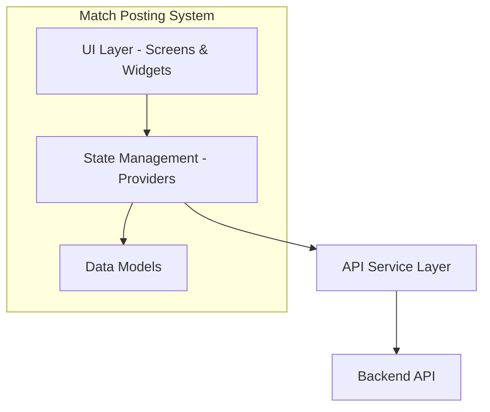
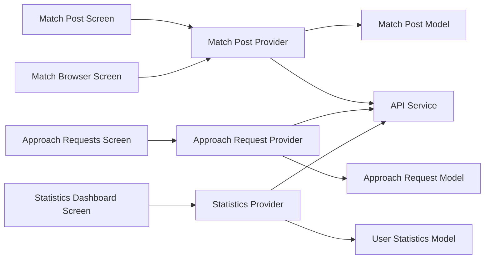
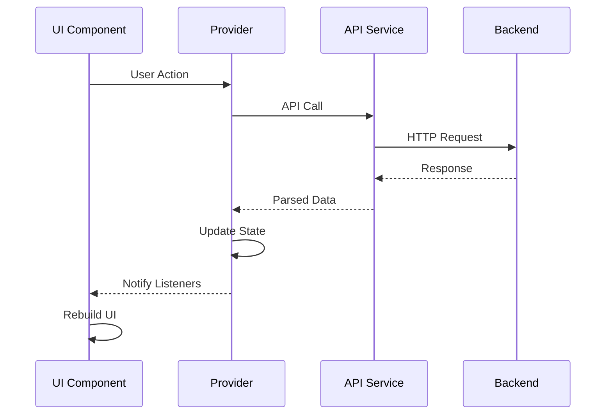

# Design Document: Match Posting and Approaching System

## Overview

The Match Posting and Approaching System is a frontend Flutter feature that enables cricket teams to post match opportunities, discover available matches, send participation requests, and track their match statistics. This system integrates with the existing Cricket Scoreboard app architecture, utilizing the established provider pattern for state management and the existing API service for backend communication.

The feature consists of four main components:

1. **Match Posting Interface** - Form-based UI for creating match posts
2. **Match Discovery Browser** - Filterable list view for browsing available matches
3. **Approach Request Management** - Interface for sending and managing participation requests
4. **User Statistics Dashboard** - Analytics view displaying match participation metrics

## Architecture

### High-Level Architecture



### Component Architecture



### State Management Flow

The system follows the existing provider pattern used in the app:



## Components and Interfaces

### 1. Data Models

#### MatchPost Model

```dart
class MatchPost {
  final String id;
  final String teamName;
  final int totalPlayers;
  final String venue;
  final int totalOvers;
  final BallType ballType;
  final DateTime matchTiming;
  final MatchType matchType;
  final String creatorId;
  final MatchPostStatus status;
  final DateTime createdAt;
  final List<String> approachRequestIds;

  // Enums
  enum BallType { redBall, stitchBall, tennisBall }
  enum MatchType { betMatch, friendlyMatch }
  enum MatchPostStatus { open, pending, confirmed, cancelled }
}
```

#### ApproachRequest Model

```dart
class ApproachRequest {
  final String id;
  final String matchPostId;
  final String requestingUserId;
  final String requestingTeamName;
  final ApproachRequestStatus status;
  final DateTime createdAt;
  final DateTime? respondedAt;

  enum ApproachRequestStatus { pending, accepted, rejected }
}
```

#### UserStatistics Model

```dart
class UserStatistics {
  final String userId;
  final int totalMatchesPosted;
  final int totalMatchesApproached;
  final int totalMatchesPlayed;
  final int totalWins;
  final int totalLosses;
  final int totalDraws;
  final Map<BallType, int> matchesByBallType;
  final DateTime lastUpdated;
}
```

### 2. Providers

#### MatchPostProvider

Manages match post creation, retrieval, and filtering.

**Responsibilities:**

- Create new match posts
- Fetch available match posts
- Apply filters (ball type, overs, venue)
- Manage match post state
- Handle pagination for match listings

**Key Methods:**

```dart
class MatchPostProvider extends ChangeNotifier {
  List<MatchPost> _matchPosts = [];
  MatchPost? _selectedMatchPost;
  Map<String, dynamic> _filters = {};
  bool _isLoading = false;

  Future<void> createMatchPost(MatchPost matchPost);
  Future<void> fetchMatchPosts({Map<String, dynamic>? filters});
  void applyFilters(Map<String, dynamic> filters);
  void clearFilters();
  Future<void> selectMatchPost(String matchPostId);
}
```

#### ApproachRequestProvider

Manages approach request creation and response handling.

**Responsibilities:**

- Send approach requests
- Fetch incoming/outgoing requests
- Accept/reject requests
- Update request status
- Manage notifications

**Key Methods:**

```dart
class ApproachRequestProvider extends ChangeNotifier {
  List<ApproachRequest> _incomingRequests = [];
  List<ApproachRequest> _outgoingRequests = [];
  bool _isLoading = false;

  Future<void> sendApproachRequest(String matchPostId, String teamName);
  Future<void> fetchIncomingRequests();
  Future<void> fetchOutgoingRequests();
  Future<void> acceptRequest(String requestId);
  Future<void> rejectRequest(String requestId);
  bool hasApproached(String matchPostId);
}
```

#### StatisticsProvider

Manages user statistics retrieval and display.

**Responsibilities:**

- Fetch user statistics
- Calculate derived metrics
- Cache statistics data
- Refresh statistics on demand

**Key Methods:**

```dart
class StatisticsProvider extends ChangeNotifier {
  UserStatistics? _statistics;
  bool _isLoading = false;

  Future<void> fetchStatistics();
  Future<void> refreshStatistics();
  int getMatchesByBallType(BallType ballType);
  double getWinPercentage();
}
```

### 3. Screens

#### MatchPostFormScreen

Form screen for creating new match posts.

**UI Components:**

- Text fields for team name, venue, total players, total overs
- Dropdown for ball type selection (Red Ball, Stitch Ball, Tennis Ball)
- Dropdown for match type selection (Bet Match, Friendly Match)
- Date/time picker for match timing
- Submit button with validation
- Loading indicator

**Validation Rules:**

- Team name: Required, 3-50 characters
- Total players: Required, 2-11 players
- Venue: Required, 3-100 characters
- Total overs: Required, 1-50 overs
- Match timing: Required, must be future date/time

#### MatchBrowserScreen

Main screen for browsing available match posts.

**UI Components:**

- Filter bar with chips/dropdowns for:
  - Ball type filter
  - Overs range filter
  - Venue search
- Scrollable grid/list of match post cards
- Pull-to-refresh functionality
- Empty state when no matches found
- Loading skeleton

**Match Post Card Design:**

```
┌─────────────────────────────────┐
│ Team Name                  🏏   │
│ ─────────────────────────────── │
│ 📍 Venue Name                   │
│ ⏱️  20 Overs | 🎾 Tennis Ball   │
│ 📅 Tomorrow, 5:00 PM            │
│ 🏆 Friendly Match               │
│                                 │
│         [Approach Match]        │
└─────────────────────────────────┘
```

#### ApproachRequestsScreen

Screen for managing incoming and outgoing approach requests.

**UI Components:**

- Tab bar for "Incoming" and "Outgoing" requests
- List of request cards with match details
- Accept/Reject buttons for incoming requests
- Status indicators for outgoing requests
- Empty state messages

**Request Card Design (Incoming):**

```
┌─────────────────────────────────┐
│ Team Warriors wants to play     │
│ ─────────────────────────────── │
│ Your Match: Team vs Team        │
│ 📍 Central Ground               │
│ ⏱️  20 Overs | 🏏 Red Ball      │
│ 📅 Tomorrow, 5:00 PM            │
│                                 │
│   [Accept]        [Reject]      │
└─────────────────────────────────┘
```

#### StatisticsDashboardScreen

Dashboard displaying user match statistics.

**UI Components:**

- Summary cards for key metrics:
  - Total Matches Posted
  - Total Matches Approached
  - Total Matches Played
- Win/Loss/Draw breakdown with visual chart
- Ball type breakdown (Red/Stitch/Tennis)
- Refresh button
- Visual charts using Flutter charts package (optional)

**Layout Design:**

```
┌─────────────────────────────────┐
│  📊 Your Match Statistics       │
├─────────────────────────────────┤
│ ┌─────┐ ┌─────┐ ┌─────┐        │
│ │ 15  │ │ 23  │ │ 12  │        │
│ │Post │ │Appr │ │Play │        │
│ └─────┘ └─────┘ └─────┘        │
├─────────────────────────────────┤
│  Match Results                  │
│  ✅ Wins: 8                     │
│  ❌ Losses: 3                   │
│  ⚖️  Draws: 1                   │
├─────────────────────────────────┤
│  Ball Type Breakdown            │
│  🏏 Red Ball: 5 matches         │
│  🧵 Stitch Ball: 4 matches      │
│  🎾 Tennis Ball: 3 matches      │
└─────────────────────────────────┘
```

### 4. Widgets

#### MatchPostCard

Reusable card widget for displaying match post information.

**Props:**

- `MatchPost matchPost`
- `VoidCallback? onTap`
- `VoidCallback? onApproach`
- `bool showApproachButton`

#### FilterChip

Custom chip widget for filter selection.

**Props:**

- `String label`
- `bool isSelected`
- `VoidCallback onSelected`

#### StatisticCard

Card widget for displaying individual statistics.

**Props:**

- `String title`
- `String value`
- `IconData icon`
- `Color? color`

#### ApproachRequestCard

Card widget for displaying approach request details.

**Props:**

- `ApproachRequest request`
- `MatchPost matchPost`
- `VoidCallback? onAccept`
- `VoidCallback? onReject`
- `bool isIncoming`

### 5. API Service Extensions

Extend the existing `ApiService` class with new endpoints:

```dart
// Match Post endpoints
Future<Map<String, dynamic>> createMatchPost(Map<String, dynamic> data);
Future<List<dynamic>> getMatchPosts({Map<String, dynamic>? filters});
Future<Map<String, dynamic>> getMatchPost(String matchPostId);
Future<Map<String, dynamic>> updateMatchPost(String matchPostId, Map<String, dynamic> data);
Future<void> deleteMatchPost(String matchPostId);

// Approach Request endpoints
Future<Map<String, dynamic>> sendApproachRequest(String matchPostId, Map<String, dynamic> data);
Future<List<dynamic>> getIncomingRequests();
Future<List<dynamic>> getOutgoingRequests();
Future<Map<String, dynamic>> acceptApproachRequest(String requestId);
Future<Map<String, dynamic>> rejectApproachRequest(String requestId);

// Statistics endpoints
Future<Map<String, dynamic>> getUserStatistics();
```

## Data Models

### MatchPost JSON Structure

```json
{
  "id": "mp_123456",
  "team_name": "Warriors XI",
  "total_players": 11,
  "venue": "Central Cricket Ground",
  "total_overs": 20,
  "ball_type": "red_ball",
  "match_timing": "2025-11-15T17:00:00Z",
  "match_type": "friendly_match",
  "creator_id": "user_789",
  "status": "open",
  "created_at": "2025-11-12T10:00:00Z",
  "approach_request_ids": []
}
```

### ApproachRequest JSON Structure

```json
{
  "id": "ar_654321",
  "match_post_id": "mp_123456",
  "requesting_user_id": "user_456",
  "requesting_team_name": "Thunder Strikers",
  "status": "pending",
  "created_at": "2025-11-12T11:00:00Z",
  "responded_at": null
}
```

### UserStatistics JSON Structure

```json
{
  "user_id": "user_789",
  "total_matches_posted": 15,
  "total_matches_approached": 23,
  "total_matches_played": 12,
  "total_wins": 8,
  "total_losses": 3,
  "total_draws": 1,
  "matches_by_ball_type": {
    "red_ball": 5,
    "stitch_ball": 4,
    "tennis_ball": 3
  },
  "last_updated": "2025-11-12T12:00:00Z"
}
```

## Error Handling

### Error Scenarios and Handling

1. **Network Errors**

   - Display user-friendly error messages
   - Provide retry mechanism
   - Cache data when possible for offline viewing

2. **Validation Errors**

   - Show inline validation messages on form fields
   - Prevent form submission until all fields are valid
   - Highlight invalid fields with red borders

3. **API Errors**

   - Handle 400 (Bad Request): Show specific field errors
   - Handle 401 (Unauthorized): Redirect to login
   - Handle 404 (Not Found): Show "Match not found" message
   - Handle 500 (Server Error): Show generic error with retry option

4. **State Errors**
   - Handle duplicate approach requests gracefully
   - Prevent actions on already-accepted/rejected requests
   - Handle race conditions with optimistic updates

### Error Display Strategy

```dart
class ErrorHandler {
  static void handleError(BuildContext context, dynamic error) {
    String message = 'An error occurred';

    if (error is ApiException) {
      message = error.message;
    } else if (error is NetworkException) {
      message = 'Network error. Please check your connection.';
    }

    ScaffoldMessenger.of(context).showSnackBar(
      SnackBar(
        content: Text(message),
        action: SnackBarAction(
          label: 'Retry',
          onPressed: () {
            // Retry logic
          },
        ),
      ),
    );
  }
}
```

## Testing Strategy

### Unit Tests

1. **Model Tests**

   - Test JSON serialization/deserialization
   - Test model validation logic
   - Test enum conversions

2. **Provider Tests**

   - Test state management logic
   - Test filter application
   - Test data transformation
   - Mock API service responses

3. **Utility Tests**
   - Test date formatting functions
   - Test validation functions
   - Test filter logic

### Widget Tests

1. **Screen Tests**

   - Test UI rendering with different states (loading, error, success)
   - Test form validation
   - Test user interactions (button taps, text input)
   - Test navigation

2. **Component Tests**
   - Test MatchPostCard rendering
   - Test FilterChip selection
   - Test StatisticCard display
   - Test ApproachRequestCard actions

### Integration Tests

1. **Flow Tests**

   - Test complete match posting flow
   - Test match browsing and filtering flow
   - Test approach request sending flow
   - Test request acceptance/rejection flow
   - Test statistics dashboard loading

2. **Navigation Tests**
   - Test navigation between screens
   - Test back button behavior
   - Test deep linking (if applicable)

### Test Data

Create mock data factories for consistent testing:

```dart
class MockDataFactory {
  static MatchPost createMatchPost({String? id, BallType? ballType}) {
    return MatchPost(
      id: id ?? 'test_mp_1',
      teamName: 'Test Team',
      totalPlayers: 11,
      venue: 'Test Ground',
      totalOvers: 20,
      ballType: ballType ?? BallType.redBall,
      matchTiming: DateTime.now().add(Duration(days: 1)),
      matchType: MatchType.friendlyMatch,
      creatorId: 'test_user_1',
      status: MatchPostStatus.open,
      createdAt: DateTime.now(),
      approachRequestIds: [],
    );
  }

  static ApproachRequest createApproachRequest({String? id}) {
    // Similar factory method
  }

  static UserStatistics createUserStatistics() {
    // Similar factory method
  }
}
```

## UI/UX Considerations

### Design Principles

1. **Consistency**

   - Use existing app theme and color scheme
   - Follow Material Design guidelines
   - Maintain consistent spacing and typography

2. **Accessibility**

   - Minimum touch target size: 48x48 dp
   - Sufficient color contrast ratios
   - Screen reader support with semantic labels
   - Support for text scaling

3. **Responsiveness**

   - Adapt layouts for different screen sizes
   - Use responsive grid layouts
   - Handle landscape orientation
   - Support tablets with multi-column layouts

4. **Performance**
   - Lazy load match posts with pagination
   - Cache images and data
   - Use skeleton loaders for better perceived performance
   - Optimize list rendering with ListView.builder

### User Feedback

1. **Loading States**

   - Show shimmer/skeleton loaders during data fetch
   - Display progress indicators for actions
   - Disable buttons during processing

2. **Success States**

   - Show success snackbars for completed actions
   - Use animations for state transitions
   - Provide visual confirmation (checkmarks, color changes)

3. **Empty States**
   - Display helpful messages when no data exists
   - Provide call-to-action buttons
   - Use illustrations or icons

### Navigation Structure

```
Home Screen
├── Match Browser Screen
│   ├── Match Post Detail (Modal/Sheet)
│   └── Match Post Form Screen
├── Approach Requests Screen
│   ├── Incoming Requests Tab
│   └── Outgoing Requests Tab
└── Statistics Dashboard Screen
```

### Filter UX

- Use chips for quick filter selection
- Show active filter count badge
- Provide "Clear All" option
- Apply filters in real-time or with "Apply" button
- Persist filter state during session

## Integration Points

### Existing App Integration

1. **Navigation**

   - Add new menu items in HomeScreen drawer/bottom nav
   - Integrate with existing navigation patterns

2. **Authentication**

   - Use existing AuthProvider for user context
   - Respect authentication state for all operations

3. **Theme**

   - Use existing ThemeProvider for consistent theming
   - Support light/dark mode

4. **API Service**
   - Extend existing ApiService class
   - Follow established error handling patterns

### Future Enhancements

1. **Real-time Updates**

   - WebSocket integration for live request notifications
   - Push notifications for approach requests

2. **Social Features**

   - Team profiles and ratings
   - Match reviews and feedback
   - Chat between teams

3. **Advanced Filtering**

   - Location-based filtering
   - Skill level matching
   - Date range filtering

4. **Analytics**
   - Track user engagement
   - Monitor match completion rates
   - Analyze popular match types and venues
